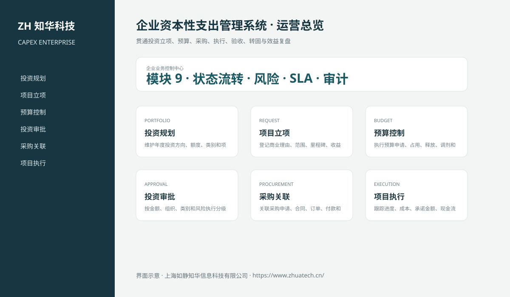
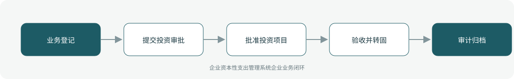

# ZhuaTech CAPEX｜企业资本性支出管理系统

> 贯通投资立项、预算、采购、执行、验收、转固与效益复盘

ZhuaTech CAPEX 是知华科技（上海如静知华信息科技有限公司）发布的企业级源码项目，面向“投资规划、项目立项、预算占用、审批、采购、执行、变更、验收、转固和收益跟踪”提供管理端与响应式业务端。工程采用前后端分离架构，所有示例数据均为虚构数据。

[知华科技官网](https://www.zhuatech.cn/) · [架构说明](docs/ARCHITECTURE.md) · [API 文档](docs/API.md) · [企业能力](docs/ENTERPRISE.md) · [测试说明](docs/TESTING.md)



## 业务模块

| 模块 | 核心能力 |
| --- | --- |
| 投资规划 | 维护年度投资方向、额度、类别和项目组合 |
| 项目立项 | 登记商业理由、范围、里程碑、收益和责任人 |
| 预算控制 | 执行预算申请、占用、释放、调剂和超支拦截 |
| 投资审批 | 按金额、组织、类别和风险执行分级决策 |
| 采购关联 | 关联采购申请、合同、订单、付款和供应商 |
| 项目执行 | 跟踪进度、成本、承诺金额、现金流和风险 |
| 投资变更 | 管理追加、范围、工期、收益变更和重新审批 |
| 验收与转固 | 完成实物验收、结算、资产拆分和会计转固 |
| 投后评价 | 对比计划与实际收益、产能、节省和回收期 |



## 企业级控制

- ADMIN / OPERATOR 角色边界和管理员接口隔离；
- 服务端字段、模块、唯一编号和状态迁移校验；
- 组织、期间、责任人、风险等级、到期日和 SLA 统计；
- 幂等创建、JPA 乐观锁、重复提交保护和职责分离；
- 附件 SHA-256 元数据、业务凭证完整性与全流程审计；
- 组合检索、分页、逾期筛选、UTF-8 CSV 导出和协作时间线；
- 外部系统仅预留适配器，使用方自行配置地址与凭据；
- prod profile 拒绝默认密码、弱数据库口令和本地跨域来源。

## 技术架构

- 后端：Java 21、Spring Boot、Spring Security、JPA、Bean Validation、Actuator
- 前端：Vue 3、Vite、Axios，支持桌面端与移动端响应式布局
- 数据库：MySQL 8；自动化测试使用 H2
- 交付：Docker Compose、Nginx、环境变量、GitHub Actions
- Java 包名：`cn.zhuatech.capex`

## 启动与测试

```bash
cd backend && mvn test
cd ../frontend && npm install && npm run build
cd .. && cp .env.example .env && docker compose up --build
```

开发演示账号：`admin / admin123`、`operator / operator123`。生产环境必须通过环境变量替换全部默认凭据。

## 许可与商业授权

Copyright © 2026 上海如静知华信息科技有限公司。

本工程仅允许个人学习、研究和非商业技术交流，**不得用于商业用途**。企业内部使用、生产部署、SaaS运营、项目交付、品牌替换、收费培训、咨询实施或再分发，均须事先获得上海如静知华信息科技有限公司书面授权，详见 [LICENSE](LICENSE)。

深度开发、私有化部署、系统集成与企业数字化咨询，请访问[知华科技官网](https://www.zhuatech.cn/)或扫码联系：

| 微信咨询一 | 微信咨询二 |
| --- | --- |
|  |  |

SEO：企业资本性支出管理系统、CAPEX系统源码、企业数字化、Java企业系统、Vue管理系统、知华科技、上海如静知华信息科技有限公司。
